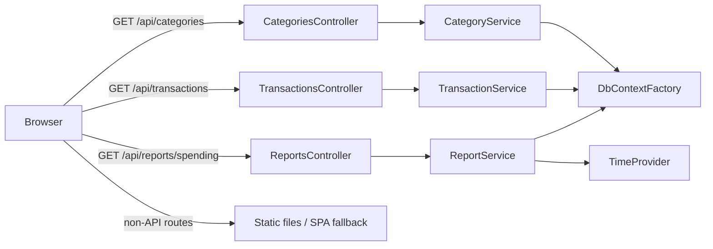

# Frontend Backend Low-Level Design

## Purpose

Define the backend work required before building the React frontend described in the UI plan. This document covers only API, hosting, registration, and test changes. It does not create the frontend or change the persistence schema.

## Scope and Decisions

- Add category-list and spending-report read endpoints.
- Extend the transaction-list query with the filters used by the Transactions page.
- Serve a built single-page application from `wwwroot` and preserve API `ProblemDetails` for unmatched `/api/*` routes.
- Keep existing transaction-category semantics unchanged: a category assignment is valid when the category exists, regardless of transaction direction. For reporting, an assigned category's `CategoryKind` is authoritative; uncategorized transactions derive their kind from direction. The UI must make this distinction clear enough that a deliberately mismatched assignment is not mistaken for automatic classification.
- Use `TimeProvider` for default report dates. The initial policy uses the host's local date because existing transactions store `DateOnly` without a timezone. A future user/account timezone setting can replace this at the `ReportService` boundary.
- Report rows are returned in a deterministic order: `PeriodStart` ascending, category kind with income before expense and null last, category name ordinal ascending with null last, then direction ascending.
- Do not add a migration. Existing categories and transaction columns contain all required data.

## Existing Boundaries



Controllers remain responsible for HTTP binding and invalid-request `ProblemDetails`. Services own database access and response construction. All services use the existing `IDbContextFactory<ExpenseTrackerDbContext>` pattern and are registered as scoped services.

## API Contracts

### `GET /api/categories`

#### Response

Return `200 OK` with a JSON array:

```json
[
  {
    "id": "10000000-0000-0000-0000-000000000001",
    "slug": "investment",
    "name": "Investment",
    "kind": "Expense",
    "parentCategoryId": null
  }
]
```

#### Ordering

Return `Income` categories before `Expense` categories. Within a kind, parent categories precede children; then order by `Name` using the database's normal collation. The client builds `<optgroup>` and indented labels from the flat result.

### `GET /api/transactions`

Extend `TransactionListQuery` with these optional query parameters:

| Parameter | CLR type | Semantics |
| --- | --- | --- |
| `categoryId` | `Guid?` | Return only rows assigned to this category. |
| `uncategorized` | `bool?` | When `true`, return only rows where `CategoryId` is null. `false` does not filter. |
| `origin` | `TransactionOrigin?` | Filter `Imported` or `Manual`. |
| `sourceFormat` | `SourceDocumentFormat?` | Filter `PaymentExport`, `BankStatement`, or `OrderHistory`. |

Existing `from`, `to`, `direction`, `page`, and `pageSize` semantics do not change.

#### Validation

- Preserve the existing `from <= to` validation.
- Return `400 ProblemDetails` when `categoryId` is supplied with `uncategorized=true`.
- Let `[ApiController]` return its standard `400` response for invalid enum, GUID, bool, date, or range binding.
- `categoryId` need not exist to filter; it returns an empty page when no transaction is assigned to it.

#### Query Construction

`TransactionService.ListAsync` composes the `IQueryable<ExpenseTransaction>` in this order:

1. Date range.
2. Direction.
3. Category or uncategorized filter.
4. Origin.
5. Source format.
6. Count, stable sort, pagination, and existing summary projection.

The list response remains unchanged. `SourceFormat` is intentionally omitted from `TransactionSummaryResponse` because the initial table uses it only as a filter. Add it later only when a display requirement exists.

### `GET /api/reports/spending`

#### Request

| Parameter | Type | Required | Semantics |
| --- | --- | --- | --- |
| `granularity` | string | Yes | Exactly `week` or `month`, case-insensitive. |
| `from` | `DateOnly?` | No | Inclusive lower date bound. |
| `to` | `DateOnly?` | No | Inclusive upper date bound. |

#### Default Date Range

Let $today$ be `DateOnly.FromDateTime(timeProvider.GetLocalNow().DateTime)`.

- `to` defaults to $today$.
- `from` defaults to the first day of the month five months before `to`'s month.
- Supplied dates are not rounded; partial first and last weekly or monthly buckets are returned.
- Return `400 ProblemDetails` when `from > to`.

#### Response

```json
{
  "granularity": "month",
  "from": "2026-02-01",
  "to": "2026-07-31",
  "rows": [
    {
      "periodStart": "2026-07-01",
      "categoryId": "10000000-0000-0000-0000-000000000009",
      "categoryName": "Grocery",
      "categoryKind": "Expense",
      "direction": "Debit",
      "total": 8421.50,
      "count": 12
    }
  ]
}
```

Use response records in `Models/Reports/ReportModels.cs`:

- `SpendingGranularity` enum with `Week` and `Month` values, serialized through the existing global string-enum converter.
- `SpendingReportQuery` binding model with nullable `Granularity`, `From`, and `To` properties.
- `SpendingReportResponse` with `Granularity`, `From`, `To`, and `IReadOnlyList<SpendingReportRow>`.
- `SpendingReportRow` with `PeriodStart`, nullable category metadata, `Direction`, `Total`, and `Count`.

#### Calculation

`ReportService.GetSpendingAsync` loads a no-tracking, date-filtered projection of `TransactionDate`, `Amount`, `Direction`, and `CategoryId`. It also loads the category names and kinds needed for assigned category IDs in one additional query. It then performs bucketing and grouping in C# so SQLite-in-memory tests and PostgreSQL use identical semantics.

For weekly reports, calculate ISO-8601 Monday-start bucket dates with:

```csharp
date.AddDays(-(((int)date.DayOfWeek + 6) % 7))
```

For monthly reports, calculate `new DateOnly(date.Year, date.Month, 1)`.

Group by `(periodStart, categoryId, direction)`. A null category produces null category metadata. Sum positive stored amounts and count rows.

An assigned category always supplies the report `CategoryKind`, even when it does not match the transaction direction. An uncategorized row does not fabricate a category kind; frontend aggregation derives income/expense from its direction as specified in the UI plan.

## File-Level Changes

### New files

| File | Responsibility |
| --- | --- |
| `ExpenseTracker/Controllers/CategoriesController.cs` | `GET /api/categories`, delegating directly to `CategoryService`. |
| `ExpenseTracker/Services/CategoryService.cs` | No-tracking category projection and specified ordering. |
| `ExpenseTracker/Models/Categories/CategoryModels.cs` | `CategoryResponse` record. |
| `ExpenseTracker/Controllers/ReportsController.cs` | Binds and validates report query, delegates to `ReportService`. |
| `ExpenseTracker/Services/ReportService.cs` | Date defaults, database projections, C# bucketing/grouping, deterministic response ordering. |
| `ExpenseTracker/Models/Reports/ReportModels.cs` | Report query, enum, response, and row records. |
| `ExpenseTracker.Tests/CategoryListTests.cs` | Category endpoint/service ordering and shape coverage. |
| `ExpenseTracker.Tests/SpendingReportTests.cs` | Report calculations and clock-dependent defaults. |
| `ExpenseTracker.Tests/ControllerValidationTests.cs` | Direct controller tests for the explicit cross-field `400` validations. |

### Modified files

| File | Change |
| --- | --- |
| `ExpenseTracker/Models/Transactions/TransactionReadModels.cs` | Add the four filter properties to `TransactionListQuery`. |
| `ExpenseTracker/Controllers/TransactionsController.cs` | Reject `categoryId` combined with `uncategorized=true`. |
| `ExpenseTracker/Services/TransactionService.cs` | Apply category, uncategorized, origin, and source-format filters before count/pagination. |
| `ExpenseTracker/Program.cs` | Register `TimeProvider.System`, `CategoryService`, and `ReportService`; add static-file middleware and fallback mapping. |
| `ExpenseTracker.Tests/TestDatabase.cs` | Register `CategoryService`, `ReportService`, and a fixed test `TimeProvider`. |
| `ExpenseTracker.Tests/TransactionQueryTests.cs` | Cover every new transaction-list filter and their combination behavior. |
| `.gitignore` | Ignore `frontend/node_modules/`, `frontend/dist/`, and generated `ExpenseTracker/ExpenseTracker/wwwroot/`. |
| `README.md` and `DEPLOYMENT.md` | Document endpoints, date semantics, Node prerequisite, frontend build, and SPA serving after frontend delivery. |

## Dependency Registration and Hosting

Add these registrations to `Program.cs` alongside the existing service registrations:

```csharp
builder.Services.AddSingleton(TimeProvider.System);
builder.Services.AddScoped<CategoryService>();
builder.Services.AddScoped<ReportService>();
```

Before `UseAuthorization()`, add:

```csharp
app.UseDefaultFiles();
app.UseStaticFiles();
```

After `MapControllers()`, add fallbacks in this order:

```csharp
app.MapFallback("/api/{**rest}", () => Results.Problem(
    statusCode: StatusCodes.Status404NotFound,
    title: "Resource not found."));
app.MapFallbackToFile("index.html");
```

The API-specific fallback is more specific than the SPA fallback. Consequently, an unknown API URL returns `application/problem+json`, while routes such as `/transactions` return the application shell. In development, static-file middleware remains harmless until the frontend build creates `wwwroot`.

## Test Design

### Service tests using `TestDatabase`

- Category list returns the seeded categories, correct kind/parent identifiers, and documented ordering.
- Transaction list filters independently by category, uncategorized status, origin, and source format. Include imported and manual test rows because source format is null for manual transactions.
- Monthly reports group rows at month boundaries, keep debit and credit separate, preserve uncategorized null metadata, and total/count accurately.
- Weekly reports prove ISO Monday boundaries: Sunday `2026-01-04` belongs to `2025-12-29`; Monday `2026-01-05` begins a new bucket.
- A fixed `TimeProvider` verifies omitted report dates without reliance on the host clock.
- Include a mismatched category-kind/direction row and assert that the stored category kind is returned unchanged.

### Controller tests

Create controller instances with real service instances from `TestDatabase`, then set a `DefaultHttpContext` on the controller when required. Assert `ObjectResult` status and `ProblemDetails.Title` for:

- `from > to` on transactions and reports.
- `categoryId` plus `uncategorized=true` on transactions.
- missing or unrecognized report granularity.

Binding and data-annotation failures are framework behavior; add an HTTP-host integration test only if the project later needs to assert its exact response body.

### Final validation

```powershell
dotnet test ExpenseTracker/ExpenseTracker.slnx
dotnet run --project ExpenseTracker/ExpenseTracker/ExpenseTracker.csproj --launch-profile https
curl.exe -k https://localhost:7085/api/categories
curl.exe -k "https://localhost:7085/api/transactions?page=1&pageSize=10&uncategorized=true"
curl.exe -k "https://localhost:7085/api/reports/spending?granularity=week"
curl.exe -k -i https://localhost:7085/api/nonexistent
```

The final request must return a `404` ProblemDetails response instead of `index.html`. After the frontend is built, additionally refresh `/transactions?direction=Debit` through the production Kestrel endpoint to confirm SPA deep-link handling.

## Implementation Order

1. Add report/category model records and service implementations, including the `TimeProvider` abstraction.
2. Extend transaction query DTO, validation, and service composition.
3. Register services and time provider in production and test dependency injection.
4. Add focused unit/controller tests and run `dotnet test`.
5. Add static files, API fallback, `.gitignore`, and documentation updates.
6. Run production-build and API smoke checks once the frontend build exists.