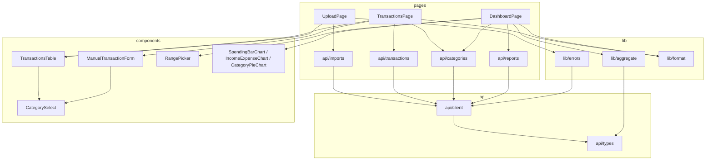

# Frontend Low-Level Design

## Purpose

Define the module-level design of the React frontend described in `react-frontend-ui.md`: exact TypeScript contracts, component props and state ownership, data flow, aggregation algorithms, and test cases. The backend is complete; this document changes no API. A section is implementable on its own once its dependencies (listed in Implementation Order) exist.

## Decisions

- **No state library, no data-fetching library.** Three pages, one user, no shared mutable state beyond the category list. Each page owns its server state with `useState`/`useEffect`; the category list uses a module-level promise cache. Adding React Query or Zustand would be dead weight at this scale.
- **URL search params are the source of truth** for transaction filters and dashboard range. Component state never duplicates them; handlers write to the URL and re-render follows.
- **The API layer returns typed data or throws `ApiError`** — components never see `fetch`, `Response`, or ProblemDetails JSON.
- **All chart math is pure functions** in `lib/aggregate.ts` operating on `SpendingRow[]` → chart-ready series. Recharts components stay declarative and logic-free; the pure layer is the Vitest surface.
- **Dates stay strings** (`yyyy-MM-dd`) end to end; conversion to `Date` happens only inside `lib/dates.ts` helpers and never leaks out.

## Module dependency graph



Rule: `pages → components → lib → api/types`. `lib` never imports from `components` or `pages`; `api` never imports from anything but `types`.

## `api/types.ts` — wire contracts

Mirrors the backend records exactly (enums are strings via the global converter):

```ts
export type Direction = 'Debit' | 'Credit';
export type Origin = 'Imported' | 'Manual';
export type SourceFormat = 'PaymentExport' | 'BankStatement' | 'OrderHistory';
export type CategoryKind = 'Income' | 'Expense';
export type Granularity = 'Week' | 'Month';
export type LineExtractionStatus = 'NotApplicable' | 'Unavailable' | 'Available';
export type TagState = 'Suggested' | 'Confirmed' | 'Rejected';
export type TagSource = 'Rule' | 'Manual';

export interface Category { id: string; slug: string; name: string; kind: CategoryKind; parentCategoryId: string | null; }

export interface TransactionSummary {
  id: string; origin: Origin; transactionDate: string; description: string;
  accountLabel: string | null; externalReference: string | null;
  direction: Direction; amount: number; currency: string;
  categoryId: string | null; receiptUrl: string | null;
  lineExtractionStatus: LineExtractionStatus; hasLines: boolean;
}

export interface TransactionPage { items: TransactionSummary[]; page: number; pageSize: number; totalCount: number; }

export interface TransactionTag { tagId: string; slug: string; name: string; state: TagState; source: TagSource; decidedAt: string; }
export interface TransactionLine { id: string; position: number; lineType: string; description: string; quantity: number | null; unitAmount: number | null; amount: number; tags: TransactionTag[]; }

export interface TransactionDetail extends TransactionSummary {
  documentImportId: string | null; importPosition: number | null;
  sourceFormat: SourceFormat | null; balanceAfter: number | null;
  lines: TransactionLine[]; tags: TransactionTag[];
}
// Note: the backend detail record has no hasLines; derive it as lines.length > 0 when reusing summary-typed code.

export interface TransactionWrite {           // body for POST and PUT /api/transactions
  transactionDate: string; description: string; direction: Direction; amount: number;
  accountLabel?: string | null; externalReference?: string | null;
  categoryId?: string | null; receiptUrl?: string | null;
}

export interface SpendingRow {
  periodStart: string; categoryId: string | null; categoryName: string | null;
  categoryKind: CategoryKind | null; direction: Direction; total: number; count: number;
}
export interface SpendingReport { granularity: Granularity; from: string; to: string; rows: SpendingRow[]; }

export interface SavedTransaction {
  id: string; importPosition: number; sourceSequence: number | null; sourceFormat: SourceFormat;
  transactionDate: string; description: string; accountLabel: string | null;
  externalReference: string | null; direction: Direction; amount: number; currency: string;
  balanceAfter: number | null; categoryId: string | null; receiptUrl: string | null;
  lineExtractionStatus: LineExtractionStatus;
}
export interface ImportResult { importId: string; isDuplicate: boolean; importedAt: string; transactions: SavedTransaction[]; }

export interface TransactionListParams {
  from?: string; to?: string; direction?: Direction; categoryId?: string;
  uncategorized?: boolean; origin?: Origin; sourceFormat?: SourceFormat;
  page?: number; pageSize?: number;
}
```

## `api/client.ts`

```ts
export class ApiError extends Error {
  constructor(
    public status: number,
    public title: string,
    public detail?: string,
    public errors?: Record<string, string[]>,   // ValidationProblemDetails field map (camelCased keys)
  ) { super(title); }
}

export async function apiFetch<T>(path: string, init?: RequestInit): Promise<T>
export async function apiFetchVoid(path: string, init?: RequestInit): Promise<void>
```

Behavior:
- Prefix every path with `/api` is NOT done here — callers pass full paths (`/api/transactions`); the module stays a dumb transport.
- `ok` → parse JSON (`apiFetch`) or return (`apiFetchVoid`).
- Non-`ok` with `content-type` containing `application/problem+json` → throw `ApiError(status, body.title ?? 'Request failed', body.detail, body.errors)` — `body.errors` is present on `[ApiController]` `ValidationProblemDetails` responses and carries per-field messages for form display.
- Non-`ok` otherwise → throw `ApiError(status, 'Request failed')` (this covers 413, which Kestrel emits without a problem+json body).
- Network failure → the native `TypeError` propagates; `AbortError` propagates untouched (UploadPage handles it specifically).
- JSON bodies: callers pass `body: JSON.stringify(...)`; `apiFetch` sets `content-type: application/json` only when `init.body` is a string (never for `FormData`, so the browser sets the multipart boundary).

Endpoint modules (thin, fully typed):

```ts
// api/categories.ts — module-level promise cache; every caller shares one request per session
let cache: Promise<Category[]> | undefined;
export function getCategories(): Promise<Category[]>      // cache ??= apiFetch(...)

// api/transactions.ts
export function listTransactions(p: TransactionListParams): Promise<TransactionPage>  // URLSearchParams, omit undefined
export function getTransaction(id: string): Promise<TransactionDetail>
export function createTransaction(body: TransactionWrite): Promise<TransactionDetail> // 201 body is ManualTransactionResponse; type as subset
export function updateTransaction(id: string, body: TransactionWrite): Promise<TransactionDetail>

// api/reports.ts
export function getSpendingReport(g: 'week' | 'month', from?: string, to?: string): Promise<SpendingReport>

// api/imports.ts
export function uploadStatement(file: File, password: string | undefined, signal: AbortSignal): Promise<ImportResult>
// FormData with fields `file` and (when non-empty) `password`; POST /api/document-extractions
```

## `lib/` contracts

### `lib/aggregate.ts` (pure; the main test surface)

```ts
export type FlowClass = 'income' | 'expense';

export function classify(row: SpendingRow): FlowClass
// categoryKind 'Income' → income; 'Expense' → expense;
// null kind → direction === 'Credit' ? income : expense

export function signedTotal(row: SpendingRow): number
// + when direction matches the class's natural direction (Credit↔income, Debit↔expense), − otherwise.
// Refund (Credit + Expense kind) → negative expense. Salary reversal (Debit + Income kind) → negative income.

// Precision: all accumulation inside this module happens in integer paise
// (Math.round(total * 100)); rupee numbers are produced only at the output
// boundary. Float summation drift never reaches chart values.

export interface PeriodFlow { periodStart: string; income: number; expense: number; }
export function incomeExpenseByPeriod(rows: SpendingRow[]): PeriodFlow[]     // sorted by periodStart

export interface CategorySlice { key: string; name: string; total: number; } // key = categoryId ?? 'uncategorized'
export function expenseByCategory(rows: SpendingRow[]): { slices: CategorySlice[]; refundOnly: CategorySlice[] }
// expense-class rows only, net per category over the whole range, sorted desc.
// slices = net > 0 (pie input); refundOnly = net <= 0, surfaced as a footnote
// line under the pie ("Refunds exceeded spending: …") instead of being silently dropped.

export interface StackedPeriod { periodStart: string; [seriesKey: string]: string | number; }
export function expenseStacks(rows: SpendingRow[], topN: number): { periods: StackedPeriod[]; seriesKeys: string[] }
// expense-class rows, net per (period, category); categories ranked by |range net|;
// ranks > topN collapse into 'other'; 'uncategorized' never collapses.
// Negative period nets are PRESERVED (not clamped) — SpendingBarChart renders them
// below the zero baseline via Recharts stackOffset="sign". topN = 6 in the app.
// seriesKeys ordered: top categories desc, then 'other', then 'uncategorized'
```

All functions sort rows internally (defensive) and never mutate inputs.

### `lib/dates.ts`

```ts
export function todayIso(): string                              // local date, yyyy-MM-dd
export function monthStartIso(iso: string): string
export function addMonthsIso(iso: string, months: number): string
export function presetRange(p: 'thisMonth' | 'last3' | 'last6'): { from: string; to: string }
```

### `lib/format.ts`

```ts
export function formatInr(amount: number): string               // ₹1,23,456.00 (en-IN)
export function formatDate(iso: string): string                 // 12 Aug 2026
export function formatPeriodLabel(g: 'week' | 'month', periodStart: string): string
// month → 'Aug 2026'; week → 'Wk of 10 Aug'
```

### `lib/errors.ts`

```ts
export function uploadErrorMessage(e: unknown): string
```

Mapping table (status + exact backend titles; first match wins):

| Condition | Message |
| --- | --- |
| 400 `The PDF could not be opened.` | Wrong password, or the PDF is corrupted. Check the password and retry. |
| 400 `The uploaded file is invalid.` / `A PDF file is required.` | That file doesn't look like a supported PDF. |
| 422 `No supported transaction data was found.` | No transaction table was found in this document. |
| 429 | The server is busy with another extraction. Try again in a few minutes. |
| 503 | The PDF decryption tool is unavailable on the server. |
| 504 | Extraction timed out — the document may be too large. |
| 502 | The extraction service failed. Check the server logs. |
| any other `ApiError` | Upload failed ({title}). |
| non-`ApiError` | Network problem — is the API running? |

`AbortError` never reaches this function (handled before mapping).

## Routing and shell

| Path | Page | URL state |
| --- | --- | --- |
| `/` | DashboardPage | `granularity` (`week`\|`month`, default `month`), `from`, `to` (default: server defaults, i.e. params omitted; custom range capped at 24 months) |
| `/transactions` | TransactionsPage | `from`, `to`, `direction`, `categoryId`, `uncategorized`, `origin`, `sourceFormat`, `page` |
| `/transactions/new` | ManualTransactionPage | none (Back preserves the list's search params via location state / history back) |
| `/transactions/:id` | TransactionDetailPage | none (same back behavior) |
| `/upload` | UploadPage | none |

Detail and create are routes, not modals — explicit links/buttons navigate; keyboard and mobile back behavior come free from the router.

`main.tsx` uses `createBrowserRouter` with `App` as the layout route (header nav + `<Outlet/>`). Unknown paths render a link back to `/`. The server's SPA fallback makes all routes refresh-safe.

## Component contracts

| Component | Props | State owned |
| --- | --- | --- |
| `CategorySelect` | `categories: Category[]; value: string \| null; disabled?: boolean; onChange(id: string \| null): void` | none (controlled) |
| `TransactionsTable` | `items: TransactionSummary[]; categories: Category[]; onCategoryChange(row, id): Promise<void>; footer?: ReactNode` — each row includes a "Details" link to `/transactions/:id`; renders as stacked cards below 768 px | per-row `pendingCategoryEdit` id while a PUT is in flight |
| `ImportResultTable` | `transactions: SavedTransaction[]` — dedicated shape for upload results (date, description, signed amount, source format); no category editing | none |
| `ManualTransactionForm` | `categories: Category[]; onCreated(t): void; onCancel(): void` — hosted by the `/transactions/new` route | form fields, submit state, field errors from `ApiError.errors` |
| `RangePicker` | `granularity; from; to; onChange({granularity, from, to})` | none (controlled from URL) |
| `SpendingBarChart` | `periods: StackedPeriod[]; seriesKeys: string[]; granularity` | none |
| `IncomeExpenseChart` | `data: PeriodFlow[]; granularity` | none |
| `CategoryPieChart` | `slices: CategorySlice[]` | none |
| `StatusBanner` | `kind: 'info' \| 'success' \| 'error'; children; onDismiss?` | none |
| `Spinner` | `startedAt: number` (ms epoch) | elapsed seconds via 1 s interval |

`CategorySelect` rendering: one `<optgroup>` per kind (Income first, matching server order), parents as plain options, children indented with `  `; first option `— Uncategorized —` maps to `null`.

Chart colors: a fixed 8-color categorical palette in `global.css` custom properties (`--chart-1` … `--chart-8`), assigned to `seriesKeys` by index so a category keeps its color across all charts within a render; `uncategorized`/`other` always use `--chart-neutral` (gray). Consult the `dataviz` skill at implementation time for the palette values and tooltip/legend conventions.

## Page state machines

### UploadPage

```
idle ──submit──▶ uploading ──2xx──▶ success(ImportResult)
  ▲                 │ AbortError ──▶ cancelled (quiet info banner)
  │                 │ ApiError/TypeError ──▶ failed(message)
  └── new file chosen / retry ◀── any terminal state
```

- `uploading`: form disabled, `Spinner startedAt` set, Cancel button wired to `AbortController.abort()`. A `beforeunload` handler plus a router blocker guard navigation: confirmed departure aborts the request ("processing cannot be resumed").
- `success`: `isDuplicate` → info banner "Already imported on {formatDate(importedAt)} — showing existing transactions." Rows shown in a dedicated `ImportResultTable` (date, description, signed amount, source format) — NOT `TransactionsTable`; the shapes differ (`SavedTransaction` has no `origin`/`hasLines`) and are not adapted into one another.
- File pre-checks before any request: extension/MIME `application/pdf` and size ≤ 25 MB, with local error messages.
- No fetch timeout — extraction legitimately runs minutes.

### TransactionsPage

- On mount and whenever search params change: `Promise.all([getCategories(), listTransactions(params)])` → render. Categories resolve instantly after first load (module cache). Each list fetch carries an `AbortController` aborted on param change/unmount, so stale responses never render.
- States: loading skeleton; "no transactions yet" empty state (both CTAs) vs "no matches — clear filters"; inline retry panel on `ApiError`.
- Filter widgets write to `useSearchParams` (delete keys for empty values, reset `page`); they never hold their own value state. Category filter encodes Uncategorized as `uncategorized=true` (and removes `categoryId` — the pair is mutually exclusive server-side). At 375 px the filters collapse into a disclosure showing the active-filter count; the table renders as stacked cards.
- Inline category change: disable that row's select → `updateTransaction(id, writeFromRow(row, newCategoryId))` → **on 200 refetch the active list query** (respects filters/sort/pagination — the row may legitimately leave a filtered view); on error restore the previous value and show a banner (field errors from `ApiError.errors` if present). `writeFromRow` copies date/description/direction/amount/labels/reference/receiptUrl unchanged.
- Pagination: Prev/Next + "Page N of ⌈totalCount / pageSize⌉".
- A "Details" link per row navigates to `/transactions/:id` (origin, source format, balance, lines table, tag chips with state/source badges). "Add transaction" navigates to `/transactions/new`; on 201 it navigates back and the list refetches.
- `/transactions/new` form: client-side mirrors of the DataAnnotations rules; on 400, `ApiError.errors` maps to per-field messages plus a summary, and focus moves to the first invalid field.

### DashboardPage

- Whenever `granularity`/`from`/`to` params change: `getSpendingReport(...)` → run the three aggregate functions → render charts. `report.from`/`report.to` echo the resolved range back into the picker display.
- Empty rows → friendly empty state ("No transactions in this range — upload a statement").

## Styling

Single `styles/global.css`, written in step 2 (tokens before pages): custom properties for surface, text, borders, accent, banner semantics, focus ring, spacing scale, radius, and `--chart-1..8` + `--chart-neutral`; system font stack; light/dark via `prefers-color-scheme` swapping property values only, with `color-scheme: light dark` on `:root` so native controls follow. Contrast targets: text ≥ 4.5:1, chart series ≥ 3:1 against surface, both modes. `prefers-reduced-motion` disables transitions and chart animations. BEM-ish class names (`.tx-table__row`, `.banner--error`). No CSS modules, no framework.

Accessibility invariants enforced by components: semantic landmarks and one `h1` per route; labels via `<label for>` and errors via `aria-describedby`; amounts always carry an explicit sign (never color-only); `:focus-visible` ring everywhere; each chart renders a visually-hidden expandable data table with the same signed values; `StatusBanner` doubles as a polite `aria-live` region.

## Vitest plan (`environment: 'node'`, `src/lib/**/*.test.ts`)

| Module | Cases |
| --- | --- |
| `aggregate` | classify: kind wins over direction; null kind falls back to direction. signedTotal: refund (Credit+Expense) negative; reversal (Debit+Income) negative. incomeExpenseByPeriod: mixed periods sorted, refund reduces expense not income. expenseByCategory: net ≤ 0 lands in `refundOnly`, not `slices`; uncategorized keeps own slice. expenseStacks: top-6 collapse into `other`; `uncategorized` never collapses; **negative period nets preserved** while ranking uses \|range net\|. Paise accumulation: a drift-prone sum (e.g. many 0.1-style values) matches the exact decimal result; zero-net cancellation case. |
| `dates` | month arithmetic across year boundary; presets against a fixed "today" (inject via parameter default override); `yyyy-MM-dd` handled as calendar components — no UTC parse shift. |
| `format` | INR lakh grouping `₹1,23,456.00`; signed amount rendering (`− ₹…` / `+ ₹…`); week/month period labels. |
| `errors` | every mapping row incl. 413; unknown ApiError; non-ApiError fallback. |
| `api/client` | stubbed global `fetch`: ok → typed JSON; problem+json → ApiError(title, detail); ValidationProblemDetails → `ApiError.errors` field map; non-JSON non-ok (413) → generic ApiError with status; AbortError propagates untouched; `content-type` set only for string bodies (not FormData). |

## Implementation order

1. Scaffold (`npm create vite@latest frontend -- --template react-ts`), `vite.config.ts` proxy/outDir, prune template, commit lockfile, pin Node 22 in `engines`.
2. `global.css` design tokens (light/dark, `color-scheme`, focus ring, chart palette) + App shell/nav + router with empty routed pages (incl. `/transactions/new`, `/transactions/:id`).
3. `api/types.ts` + `api/client.ts` (incl. ValidationProblemDetails parsing) + endpoint modules + client tests.
4. `lib/` modules + Vitest (no UI needed; suite green before any page).
5. TransactionsPage (+ Table/cards, CategorySelect, refetch-on-mutation) + ManualTransactionPage + TransactionDetailPage — proves list/PUT/POST through the proxy.
6. UploadPage (dropzone, pre-checks, navigation guard, cancel, error map, ImportResultTable) — proves the long-request paths.
7. DashboardPage (+ RangePicker with 24-month cap, sign-aware stacked bars, pie + refund footnote, chart data tables).
8. Backend hardening (`UseHttpsRedirection` + `UseHsts` outside Development); prod build into `wwwroot`; README/DEPLOYMENT updates incl. the release script that asserts `wwwroot/index.html` exists.

Verification for each step and the final browser checklist are in `react-frontend-ui.md`.
