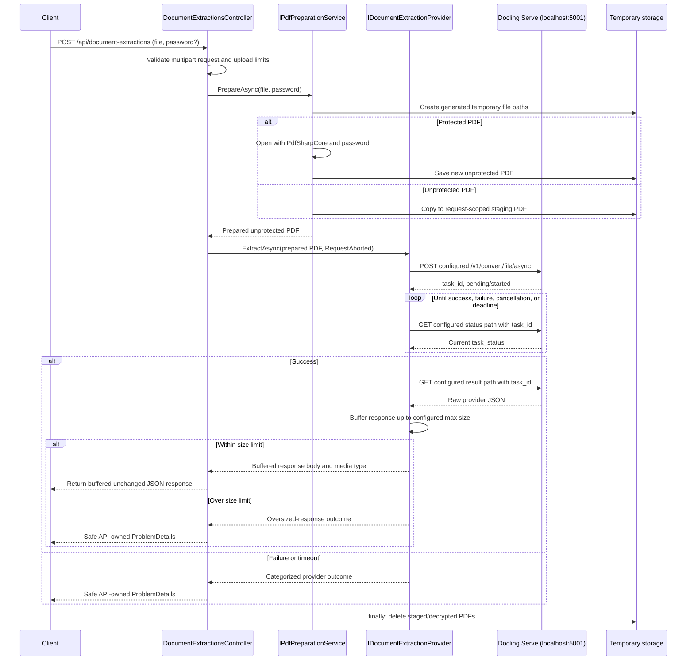

# Provider-Agnostic Document Extraction Endpoint

## Objective

Add one public ASP.NET Core endpoint that accepts a PDF and an optional password, creates an unprotected request-scoped PDF, sends it to the configured extraction provider through Docling Serve's asynchronous job API, polls for completion, and returns the completed provider JSON unchanged.

The public API uses document-extraction terminology rather than Docling terminology so the upstream provider can be replaced later.

## Decisions

- Public endpoint: `POST /api/document-extractions` using `multipart/form-data` fields `file` (required) and `password` (optional).
- The caller supplies only the file and optional password. All provider URL, transport, timeout, polling, multipart, and conversion settings come from `appsettings*.json`.
- Successful provider output is returned as raw `application/json`; it is not deserialized, normalized, wrapped, or mapped into transaction DTOs.
- Local and provider failures are returned as API-owned `ProblemDetails`. Raw provider error bodies, passwords, temporary paths, stack traces, and document-derived personal data are not exposed.
- Use ASP.NET Core and .NET libraries including `IHttpClientFactory`, `IOptions`, multipart abstractions, `System.Text.Json`, `System.Net.Http`, and `ProblemDetails`.
- Keep the existing `PdfSharpCore` 1.3.67 dependency only for opening protected PDFs and creating unprotected copies. Do not add Newtonsoft.Json, a paid SDK, or another JSON/PDF package.
- The current local provider is the official `docling-serve` CPU image. It is bound to `127.0.0.1:5001` and is not part of the API's lifecycle management.
- Response-size enforcement: the provider reads the successful upstream response into a bounded buffer, checked against the configured maximum response size, before any bytes or headers are sent to the client. If the upstream body exceeds the limit, no response is ever committed with a `200 OK`; the API returns a safe `ProblemDetails` instead. The API never streams a live pass-through of the upstream connection and never sends a partial body.
- Transient polling resilience: a transport-level failure on a single status or result request (timeout, connection reset, transient 5xx) is retried using a configured bounded backoff policy instead of failing the whole job. Only an explicit terminal `task_status: failure`, a malformed task payload, or deadline expiry stops the poll loop immediately.
- Transport requirement: the endpoint only accepts requests over HTTPS. Plaintext HTTP requests are rejected outright rather than redirected, because a redirect cannot undo a password already transmitted in cleartext.
- This slice excludes transaction normalization, persistence, OCR policy enforcement, authentication, rate limiting, UI, custom Python code, and container management.

## Request Flow

The controller does not know provider endpoints or conversion settings. It calls `IDocumentExtractionProvider`; `DoclingDocumentExtractionProvider` is the only component that knows the Docling async, polling, and result protocol. Replacing Docling later should require changing only the provider implementation and dependency-injection registration.

## Implementation Phases

### Phase 1: Public contract and configuration

1. Add endpoint binding for exactly one `IFormFile file` and nullable `string password`. Reject absent, empty, malformed, non-PDF, and over-limit uploads before provider invocation, enforced via Kestrel's `MaxRequestBodySize` and the multipart `FormOptions` (`MultipartBodyLengthLimit`, `ValueLengthLimit`) sized from the configured maximum file size — not left at ASP.NET Core's untuned defaults. Require HTTPS for the endpoint.
2. Add `DocumentExtractionOptions` in `Options/` and bind it from a `DocumentExtraction` section in `appsettings.json` and the development override. Validate options on startup.
3. Keep all provider-facing values in JSON configuration:
   - provider base URL and async submit, status-poll, and result path templates;
   - overall extraction deadline, individual HTTP timeout, polling interval, maximum file size, and maximum response size;
   - a transient polling retry policy (maximum retry attempts and backoff delay) for status/result network failures, distinct from the terminal task-failure and deadline conditions;
   - multipart file-field name and fixed HTTP headers if required later;
   - a `ConversionOptions` representation matching every supported `docling-serve` conversion option for the pinned service version, including scalar values, repeatable list values, and nested/custom option payloads.
4. Use `System.Text.Json` `JsonElement` only for provider-defined nested objects. No Docling setting should be hard-coded in C#.
5. Add configuration mapping tests for scalar values, repeated list form fields, booleans, null/omitted values, and nested JSON option payloads.

### Phase 2: Secure PDF preparation

1. Add `IPdfPreparationService` and an implementation that generates unpredictable temporary file names (e.g., via `Path.GetRandomFileName()`) inside a dedicated, request-scoped staging directory — never the client file name and never a fixed or guessable path.
2. Copy an unprotected PDF into request-scoped staging. Open a protected PDF with the supplied password through `PdfSharpCore`, create a new PDF, clear encryption/password settings, and save the unprotected copy.
3. Validate the PDF signature and readable document structure. Map missing or incorrect passwords and unsupported/corrupt encryption to safe errors.
4. Dispose streams and documents promptly. Delete source and decrypted staging artifacts in `finally`, including cancellation and provider failures.
5. Add targeted tests using synthetic or redacted protected and unprotected PDFs. Prove that the outgoing staged PDF opens without a password and all temporary artifacts are removed.

### Phase 3: Provider adapter and async orchestration

1. Define an extractor-neutral `IDocumentExtractionProvider` operation that accepts an already-unprotected PDF stream or path and a cancellation token, and returns the successful upstream payload stream plus media type.
2. Implement `DoclingDocumentExtractionProvider` behind that interface.
3. Register a named or typed `HttpClient` with .NET's `IHttpClientFactory`.
4. Build `MultipartFormDataContent` from `DocumentExtractionOptions`, submitting the staged PDF to the configured async route. Parse only the small task submission and status envelopes with `System.Text.Json` to obtain and inspect `task_id` and `task_status`.
5. Poll until success or failure, using the configured polling interval and a linked cancellation token bounded by the configured overall deadline and `HttpContext.RequestAborted`.
6. Distinguish terminal outcomes from transient ones while polling: an explicit `task_status: failure`, a malformed task payload, or deadline expiry stop the poll loop immediately and map to a safe API error. A transport-level failure on a single status or result request (timeout, connection reset, transient 5xx) is retried using the configured backoff policy instead of failing the whole job, bounded by the overall extraction deadline and the configured maximum retry attempts.
7. Read the successful upstream response into a bounded buffer, enforcing the configured maximum response size before any bytes reach the controller. If the upstream body exceeds the limit, discard the buffered bytes and return a safe `ProblemDetails`; never write a partial body to the client. Once the full response is read and validated, return it to the controller as a ready-to-read buffered stream so the controller writes the complete, unchanged body with a single `200 OK` — response headers must never be sent before the size check has passed.

### Phase 4: Controller, errors, and verification

1. Add `DocumentExtractionsController` at `POST /api/document-extractions`. It performs binding and validation, invokes PDF preparation, invokes `IDocumentExtractionProvider`, copies the raw successful result to the caller, and owns no provider-specific route or options logic.
2. Return `ProblemDetails` for invalid files, unsupported or corrupt PDFs, missing or wrong passwords, oversized uploads, invalid configuration, provider unavailability, failed jobs, and extraction deadlines.
3. Log only outcome, category, duration, and correlation data. Omit file contents, document-derived personal data, passwords, PDF names, and temporary paths.
4. Add an xUnit test project if one is not present. Unit-test configuration-to-multipart mapping, PDF preparation, async status transitions, timeout/cancellation, cleanup, raw JSON pass-through, and safe error mapping.
5. Use a stub `HttpMessageHandler` for provider tests; do not require the real container in unit tests.
6. Add a concise README link to the local setup guide, local configuration keys, one API request example, expected long-running request behavior, and the explicit note that raw upstream JSON is intentionally passed through.
7. Run `dotnet build`, focused tests, and manual API checks against the live local Docling instance using protected and unprotected redacted or synthetic PDFs. Confirm returned JSON matches the provider response byte-for-byte except HTTP transfer framing, and no temporary files remain afterward.

## Relevant Files

- `ExpenseTracker/Program.cs`: bind and validate options, register services and typed or named `HttpClient`, require HTTPS, and configure Kestrel/multipart request limits (`MaxRequestBodySize`, `MultipartBodyLengthLimit`, `ValueLengthLimit`) from configuration.
- `ExpenseTracker/appsettings.json`: production-safe `DocumentExtraction` defaults.
- `ExpenseTracker/appsettings.Development.json`: local `http://localhost:5001` settings and development overrides.
- `ExpenseTracker/Controllers/DocumentExtractionsController.cs`: provider-agnostic HTTP endpoint.
- `ExpenseTracker/Models/DocumentExtraction/DocumentExtractionRequest.cs`: endpoint request binding and API contract support.
- `ExpenseTracker/Options/DocumentExtractionOptions.cs`: validated transport and conversion configuration.
- `ExpenseTracker/Services/IPdfPreparationService.cs` and implementation: secure unprotected staging and deletion.
- `ExpenseTracker/Services/IDocumentExtractionProvider.cs` and `DoclingDocumentExtractionProvider.cs`: provider abstraction and Docling async/poll adapter.
- `ExpenseTracker.slnx` and a new `ExpenseTracker.Tests/` project: only if tests are scaffolded in this slice.
- `README.md`: compact setup and endpoint usage section.

## Security and Resource Rules

- Generate temporary file names using an unpredictable mechanism such as `Path.GetRandomFileName()` inside a dedicated, request-scoped staging directory — never a predictable or fixed name.
- Never use the client-supplied file name as a filesystem path.
- Never log or persist passwords. Require HTTPS for the endpoint and reject plaintext HTTP requests outright rather than redirecting, since a redirect cannot undo a password already transmitted in cleartext.
- Delete all temporary files in `finally` on success, failure, cancellation, and timeout.
- Bound upload size via Kestrel's `MaxRequestBodySize` and the multipart `FormOptions` (`MultipartBodyLengthLimit`, `ValueLengthLimit`), in addition to the configured provider HTTP timeout, overall extraction duration, and response size.
- Retry transient transport failures during polling with a bounded backoff; treat only explicit terminal task failure or deadline expiry as a stop condition.
- Do not expose raw upstream errors, internal paths, stack traces, or document contents.
- Keep the local Docling binding on `127.0.0.1` unless the deployment explicitly requires another network boundary.

## Verification Criteria

1. Startup validation rejects an invalid base URL, non-positive poll interval or timeout, missing route templates, and invalid size limits.
2. Both unprotected and password-protected PDF requests reach the configured async endpoint with a PDF that opens without a password.
3. The async submit, poll, and result sequence completes for the local service despite conversion taking longer than Docling's synchronous 120-second limit.
4. A success response contains the exact provider JSON payload, not a normalized or wrapped DTO. A local or provider failure produces safe `ProblemDetails`.
5. Focused tests cover wrong or missing passwords, invalid PDFs, timeout, failed jobs, request cancellation, multipart mapping, and temporary-file cleanup.
6. An upstream response larger than the configured maximum response size never reaches the client as a partial body; it produces a safe `ProblemDetails` instead, with no response headers sent beforehand.
7. A transient network failure during a single status or result poll is retried and does not fail the job on its own; only terminal task failure or deadline expiry does. A plaintext HTTP request to the endpoint is rejected rather than redirected. Uploads exceeding the configured limit are rejected by Kestrel/multipart size limits before reaching provider invocation. Generated temporary file names are unpredictable and never derived from client input.
8. `dotnet build ExpenseTracker/ExpenseTracker.slnx` and the test project succeed.
