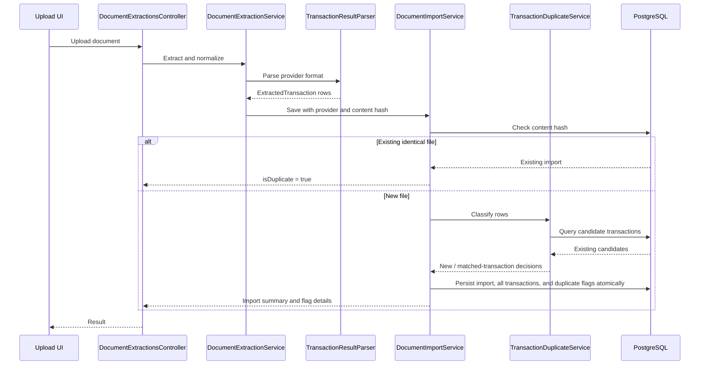

# High-Level Design: Source Tracking and Transaction Deduplication

## 1. Objective

Surface likely duplicates from overlapping imports for human review, without ever silently dropping a row, while preserving the existing fast path for byte-identical files. Track the provider that produced each uploaded document so future matching rules can be source-aware.

Every extracted row is always persisted. When a row looks like a duplicate of an existing transaction, it is saved along with a flag referencing the matched transaction; a person decides later whether it really is a duplicate. This first slice never auto-skips a row and never auto-deletes/merges a transaction.

Initial providers:

- SuperMoney
- Instamart
- BankStatement
- Manual, represented by no document import

## 2. Current Facts

The current SuperMoney parser imports successful payment rows with:

- `Name` -> `ExpenseTransaction.Description`
- `Bank` -> `ExpenseTransaction.AccountLabel`
- signed `Amount` -> positive `Amount` plus `Debit`/`Credit`
- `Date` -> `TransactionDate`
- no stable reference ID
- no balance
- no stable source sequence

`ImportPosition` and `SourceSequence` are file-local positions and cannot identify the same real-world transaction across different date-range exports.

Description alone is not unique because the same merchant can occur multiple times.

## 3. Data Model

Add a provider enum and provider field to `DocumentImport`:

- `SourceProvider.SuperMoney`
- `SourceProvider.Instamart`
- `SourceProvider.BankStatement`

`DocumentImport.Provider` is the authoritative provider value because one uploaded document comes from one provider.

Keep the existing transaction fields:

- `Origin`: `Imported` or `Manual`
- `SourceFormat`: document layout such as `PaymentExport`, `BankStatement`, or `OrderHistory`
- `DocumentImportId`: relationship to the source document

Manual transactions have no `DocumentImportId` and therefore no provider. Do not duplicate `SourceProvider` on every transaction in the first version. Provider filtering can later be denormalized if query performance requires it.

Existing imported transactions with `SourceFormat = PaymentExport` are treated as SuperMoney during the data migration. If all current imported rows are known to be SuperMoney, the migration sets `document_imports.provider = 'SuperMoney'` for their imports.

### 3.1 Duplicate flag

Add new enums, mirroring the existing `ITagAssignment`/`TransactionTag` suggest-then-decide pattern:

- `DuplicateMatchReason.ExternalReference` (Instamart order ID or bank statement `Chq/Ref. No.`)
- `DuplicateMatchReason.Composite` (date + amount + direction + normalized description + account label + currency)
- `DuplicateFlagState.Suggested`, `DuplicateFlagState.Confirmed`, `DuplicateFlagState.Rejected`

Add `TransactionDuplicateFlag`:

- `Id`
- `TransactionId`: the newly imported row being flagged
- `MatchedTransactionId`: the single pre-existing transaction it was flagged against
- `Reason`: `DuplicateMatchReason`
- `State`: `DuplicateFlagState`, defaults to `Suggested` when created by the importer
- `SuggestedAt`: timestamp when the importer creates the suggestion
- `DecidedAt`: null while `Suggested`; set when a later review changes the state to `Confirmed` or `Rejected`

A transaction has at most one `TransactionDuplicateFlag` (unique index on `TransactionId`). `MatchedTransactionId` is not unique; one existing transaction may be the match target for several later flags. `Confirmed`/`Rejected` transitions and any effect on totals/reports are out of scope for this slice (see §11); the field exists so a later slice can add the decision without another migration.

## 4. Duplicate Identity Rules

### 4.1 Existing SuperMoney data

SuperMoney does not provide a stable external transaction ID. The available comparison key is:

`transaction date + amount + direction + normalized description + account label + currency`

Normalization:

- trim leading/trailing whitespace
- case-insensitive comparison
- collapse repeated whitespace
- remove punctuation characters and replace them with a single space; preserve letters, digits, and Unicode whitespace
- compare monetary values at the stored two-decimal precision

This composite is a possible-match signal only. It is never a unique identity and must never cause a SuperMoney row to be skipped or altered automatically. A same-day purchase such as two chai transactions from the same vendor can legitimately produce the same composite; the row is still saved, only flagged.

Do not use description alone. Do not use `ImportPosition` or `SourceSequence`.

### 4.2 Future sources

- Instamart: external order ID (`ExternalReference`, already populated by the parser today) is the strong identity; composite fields are fallback when it is absent.
- Bank statement: `Chq/Ref. No.` (`ExternalReference`, already populated by the parser today) is the strong identity when present; composite fields are fallback.
- SuperMoney: use an external reference if a future parser version provides one; otherwise use the SuperMoney composite.
- Manual: compare using the fields actually provided.

Every imported row is saved regardless of match outcome. A match only ever adds a `TransactionDuplicateFlag`; it never skips, alters, or rejects the row. `DuplicateMatchReason.ExternalReference` records an exact normalized `ExternalReference` match; `DuplicateMatchReason.Composite` records a SuperMoney/manual composite match. If both signals are available, `ExternalReference` takes precedence. Both reasons behave identically at persistence time and differ only as review metadata shown to the user.

When a row matches more than one existing transaction (ambiguous case), flag against a single best candidate chosen deterministically: prefer the closest `TransactionDate` to the incoming row, then the smallest `Id` as a final tie-break. Do not create more than one flag per incoming row.

No database unique constraint or duplicate-detection index is added because the SuperMoney identity is probabilistic. Candidate lookup uses the existing `ix_transactions_external_reference` index and the general transaction indexes, not a composite index.

## 5. Components

### `TransactionDuplicateService`

New scoped service responsible for:

- normalizing descriptions and identity values
- selecting candidates in application code using the existing transaction query paths; do not rely on a removed composite index
- comparing normalized values
- returning `New` (no match) or a single `MatchedTransaction` (`MatchedTransactionId` + `DuplicateMatchReason`) per incoming row, applying the closest-date/lowest-id tie-break when more than one candidate matches
- comparing only with transactions that existed before the current upload began

Incoming rows must not be compared with one another. Similar rows within one uploaded file may be legitimate separate transactions and remain eligible for import.

The service owns matching policy; `DocumentImportService` owns import transaction boundaries.

### `DocumentImportService`

Retain SHA-256 content-hash idempotency. For a new file:

1. capture the pre-upload database state used for matching
2. classify each extracted row against that pre-existing state only
3. create one `DocumentImport` with provider metadata
4. persist every extracted row unconditionally; for rows with a match, also add a `TransactionDuplicateFlag` (`State = Suggested`) referencing the matched transaction
5. retain the original row positions for persisted rows
6. return imported rows plus per-row flag details
7. commit atomically

Rows from the same upload are never compared with each other and are never altered because they look similar to another incoming row. No row is ever skipped by this service.

The zero-transaction idempotency path from before this revision no longer applies: since no row is ever skipped, a `DocumentImport` for a new content hash always has at least one transaction per extracted row.

### `TransactionResultParser`

Continue producing normalized `ExtractedTransaction` records. Add provider assignment at the import orchestration boundary or parser result metadata; do not infer provider from transaction description.

## 6. Import Flow



## 7. API Contract

Keep `POST /api/document-extractions` as the entry point. Extend `TransactionImportResult` with:

- provider
- imported count (always equals the number of extracted rows; nothing is skipped)
- flagged duplicate count
- per-row flag details: matched existing transaction ID, match reason (`ExternalReference`/`Composite`), flag state (`Suggested`)

Preserve `IsDuplicate` for identical files. It must not be reused for row-level flagging.

The first UI slice displays the counts and flagged rows with their matched transaction. A later slice adds the confirm/reject decision endpoint and any resulting report/total exclusion; it is outside this HLD's first implementation boundary.

## 8. Persistence and Migration

Modify EF configuration for `DocumentImport.Provider`, add a migration, and backfill existing imports:

- imports whose existing transactions are `PaymentExport` -> `SuperMoney`
- no provider for imports with no known source only if such imports exist; otherwise fail migration validation rather than silently guessing

Remove `ix_transactions_duplicate_detection`. It includes `ExternalReference`, which is null for SuperMoney, and it must not be mistaken for a uniqueness guarantee. The first slice performs application-side comparison over transactions selected by existing general indexes/query paths. Do not add a normalized-description index until measurements show that the application-side candidate query is insufficient.

Add EF configuration for `TransactionDuplicateFlag`: unique index on `TransactionId`, non-unique index on `MatchedTransactionId`, foreign keys to `ExpenseTransaction` for both `TransactionId` and `MatchedTransactionId` with `DeleteBehavior.Cascade` on `TransactionId` (the flag has no purpose once its own transaction is deleted) and `DeleteBehavior.Restrict` on `MatchedTransactionId` (do not silently orphan a flag by cascading through the matched side). Do not store raw files, passwords, filenames, or provider JSON.

## 9. Failure and Concurrency Rules

- Identical uploads continue to return the existing import.
- A unique content-hash constraint protects concurrent identical uploads.
- The import transaction remains atomic: extraction rows, their persistence, and any duplicate flags are either all committed together or nothing is committed.
- No row is ever skipped, altered, or rejected because of a duplicate match; a match only adds a `Suggested` flag for later human review.
- The first slice assumes only one document upload is processed at a time. Different overlapping files uploaded concurrently are outside the concurrency guarantee and may create duplicate rows or missed flags; serialization or a durable identity constraint requires a later design decision.
- A failed or invalid extraction creates no `DocumentImport`.

## 10. Verification

Backend tests must cover:

- SuperMoney overlap between one-month and two-month exports produces flags, and every row is still persisted
- same description but different date/amount/account remains unflagged (`New`)
- identical composite occurring twice on the same day is persisted and flagged against the single best-candidate match, not rejected
- a manual row matched by a SuperMoney import is flagged (`Composite` reason) and both rows remain saved
- an Instamart/BankStatement row with an exact `ExternalReference` match is persisted and flagged (`ExternalReference` reason)
- an Instamart/BankStatement row whose `ExternalReference` matches more than one existing transaction is flagged against the closest-date/lowest-id candidate only, with exactly one flag row created
- provider backfill for existing imports
- concurrent identical uploads

Run focused .NET tests, full `dotnet test`, frontend typecheck/tests, and a manual overlap import using realistic redacted SuperMoney data. Verify that every extracted row results in a persisted transaction and that flagged rows are visible with their matched transaction ID in the API response.

## 11. Scope Boundaries

Included:

- provider ownership on document imports
- `TransactionDuplicateFlag` data model referencing the matched transaction, with a `Suggested`/`Confirmed`/`Rejected` state and a match reason
- SuperMoney/manual composite matching and Instamart/BankStatement `ExternalReference` matching, both producing flags only
- deterministic single-candidate selection for ambiguous matches
- migration and regression tests

Excluded from the first slice:

- fuzzy matching
- account reconciliation
- automatic merging of categories or tags
- deletion of existing duplicates
- confirm/reject decision endpoint and UI
- any effect of `Confirmed`/`Rejected` state on totals or reports
- provider-specific UI configuration

## 12. Low-Level Design

### 12.1 Files and ownership

The first implementation should stay within the existing persistence, extraction, and import seams:

| File | Responsibility |
| --- | --- |
| `Models/Persistence/Entities.cs` | Add `SourceProvider`, `DuplicateMatchReason`, `DuplicateFlagState`, and `TransactionDuplicateFlag`; add navigation properties to `ExpenseTransaction`. |
| `Models/Extraction/ExtractedTransaction.cs` | Add provider-aware import result records and per-row duplicate flag details; do not add `Provider` to `ExtractedTransaction` itself. |
| `Data/ExpenseTrackerDbContext.cs` | Configure the provider column, flag table, relationships, indexes, and constraints. Remove `ix_transactions_duplicate_detection`. |
| `Services/TransactionDuplicateService.cs` | Own candidate lookup, normalization, matching policy, and deterministic candidate selection. This is the deep module at the matching seam. |
| `Services/DocumentImportService.cs` | Own content-hash idempotency, the database transaction, entity creation, and result projection. It must not implement matching rules. |
| `Services/DocumentExtractionService.cs` | Pass provider metadata from the parser/import orchestration into `DocumentImportService`. |
| `Services/TransactionResultParser.cs` | Continue parsing rows and existing source formats; do not query the database or decide duplicates. |
| `Program.cs` and `ExpenseTracker.Tests/TestDatabase.cs` | Register the new scoped service and its test registration. |
- `frontend/src/api/types.ts` and the relevant `frontend/src/App.tsx` result-rendering section | Mirror the response contracts and display flagged rows read-only. |
| `Migrations/*` | Add the provider and duplicate-flag schema changes, including removal of the obsolete composite index. |

The existing `TransactionTag` model is a pattern for stateful suggestions, but duplicate flags are a separate relationship because a flag points from a newly imported transaction to another transaction. Do not reuse tag entities or tag state enums.

### 12.2 Persistence model

Add the following entity shape:

```csharp
public sealed class TransactionDuplicateFlag
{
    public Guid Id { get; set; }
    public Guid TransactionId { get; set; }
    public ExpenseTransaction Transaction { get; set; } = null!;
    public Guid MatchedTransactionId { get; set; }
    public ExpenseTransaction MatchedTransaction { get; set; } = null!;
    public DuplicateMatchReason Reason { get; set; }
    public DuplicateFlagState State { get; set; }
    public DateTimeOffset SuggestedAt { get; set; }
    public DateTimeOffset? DecidedAt { get; set; }
}
```

Use `SuggestedAt` rather than overloading `DecidedAt`: a newly created `Suggested` flag has not been decided. `DecidedAt` remains null until a later confirm/reject operation. The decision endpoint is out of scope, but this shape prevents a second migration when it is added.

Add these navigation properties:

```csharp
public List<TransactionDuplicateFlag> DuplicateFlags { get; set; } = [];
public List<TransactionDuplicateFlag> MatchedByDuplicateFlags { get; set; } = [];
```

Configure the table as `transaction_duplicate_flags` with:

- primary key `id`
- required `transaction_id`, `matched_transaction_id`, `reason`, `state`, and `suggested_at`
- nullable `decided_at`
- enum columns stored as strings, matching existing enum configuration
- unique index `ix_transaction_duplicate_flags_transaction_id`
- lookup index `ix_transaction_duplicate_flags_matched_transaction_id`
- cascade delete from the flagged transaction to its own flag
- restrict delete from the matched transaction, so historical review references cannot disappear implicitly

Add a check constraint preventing self-reference:

```sql
transaction_id <> matched_transaction_id
```

The application must also ensure that `MatchedTransactionId` belongs to a transaction that existed before the current upload. This is a temporal import invariant and cannot be represented by a simple foreign key.

Because `MatchedTransactionId` uses `DeleteBehavior.Restrict`, any future transaction or document deletion must first delete or reassign dependent duplicate flags. The first slice has no deletion workflow; this is an explicit constraint for that later feature.

`DocumentImport.Provider` is required for new imports and stored as a string with the same maximum length convention as other enums. The migration must backfill it before making the column non-null. Before generating the migration, run a data check that every existing import's transactions have one known source format. If any import contains mixed or unknown formats, stop the migration and resolve the data rather than guessing.

### 12.3 Matching interface

Keep the public interface small:

```csharp
public sealed record DuplicateMatch(
    Guid MatchedTransactionId,
    DuplicateMatchReason Reason);

public interface ITransactionDuplicateService
{
    Task<IReadOnlyList<DuplicateMatch?>> ClassifyAsync(
        SourceProvider provider,
        IReadOnlyList<ExtractedTransaction> incoming,
        DateTimeOffset importStartedAt,
        CancellationToken cancellationToken);
}
```

The result list has exactly one element per incoming row and preserves input order. A null element means no match. A non-null element identifies the one transaction to reference from the flag.

The service must not insert or update entities. It receives a read-only database view of transactions that predate the import and returns values. `DocumentImportService` remains the only module that persists the import and flags.

### 12.4 Candidate lookup and comparison

For each incoming row, apply the following pipeline:

1. Exclude rows with unsupported or missing identity fields from matching; persist them without a flag.
2. Select database candidates using exact date, amount, direction, currency, and, when present, a non-null `ExternalReference`. Do not use a raw equality predicate for the reference because comparison is normalized in application code. Use `AsNoTracking()`.
3. Restrict candidates to existing transactions with `Origin = Imported` or `Origin = Manual` as appropriate and `DocumentImportId` not belonging to the current import. Because the import has not been inserted yet, the pre-upload query naturally excludes its rows; keep the explicit invariant in the service contract.
4. For `ExternalReference`, normalize by trimming and ordinal case-insensitive comparison. An exact non-empty normalized reference match produces `Reason = ExternalReference`.
5. For composite matching, normalize `Description` and `AccountLabel` by trimming, collapsing whitespace, applying the punctuation policy in §4.1, and using ordinal case-insensitive comparison. Compare amount at two decimal places and currency case-insensitively. If an exact normalized external reference match exists, do not also create a composite match; reference reason has precedence.
6. If no candidate remains, return null.
7. If several candidates remain, order by absolute date distance, then `Id`, and return the first. The selected candidate is only a review pointer; it is not asserted to be the true duplicate.

The candidate prefilter must not use description alone. A null `ExternalReference` must never match another null reference. A missing optional `AccountLabel` matches only another missing account label for the composite rule; this avoids treating an unknown account as equal to every account.

The existing `ix_transactions_external_reference` supports reference lookup, but the service must still apply normalized comparison in memory. The remaining single-column date index is the only database prefilter after removing `ix_transactions_duplicate_detection`; amount, direction, currency, and description comparison happen in the service. This is an intentional simplicity trade-off for the current data volume and must be measured during the manual overlap test before adding any replacement composite index. Do not add a normalized-description database column or index in this slice.

### 12.5 Import transaction sequence

`DocumentImportService.SaveAsync` should use this sequence:

1. Call `FindAsync(contentHash)` before extraction as today. If an import exists, return it without creating flags or transactions.
2. Derive and validate one `SourceProvider` for the parsed rows. Reject mixed provider results before opening the persistence transaction.
3. Start one database context and one database transaction.
4. Classify all incoming rows before adding any incoming transaction entities. This establishes the pre-upload candidate set and prevents same-upload rows from matching each other. The service must compare normalized external references in memory rather than relying on raw SQL equality.
5. Create the `DocumentImport` with provider, content hash, and import timestamp.
6. Create one `ExpenseTransaction` for every extracted row with the original zero-based `ImportPosition` and `Currency = "INR"` unless currency becomes parser data later.
7. For each non-null match, create one `TransactionDuplicateFlag` with a new ID, `Suggested` state, `SuggestedAt = importedAt`, and the returned matched transaction ID/reason.
8. Add the complete graph to the context and call `SaveChangesAsync` once.
9. Commit the transaction. Roll back on any exception or cancellation.
10. Project the saved transactions and flags into `TransactionImportResult` after commit.

The content-hash check and insert must remain protected by the existing unique constraint. A concurrent identical upload may still lose the race during `SaveChangesAsync`; catch the unique violation, discard the losing transaction, and load the winning import as today. The first slice does not promise deduplication across concurrent different files.

### 12.6 Result contracts

Replace the current transaction-only result projection with records that preserve existing fields and expose review metadata:

```csharp
public sealed record TransactionImportResult(
    Guid ImportId,
    bool IsDuplicate,
    DateTimeOffset ImportedAt,
    SourceProvider Provider,
    int ImportedCount,
    int FlaggedDuplicateCount,
    IReadOnlyList<SavedTransaction> Transactions);

public sealed record SavedTransaction(
    Guid Id,
    int ImportPosition,
    int? SourceSequence,
    SourceDocumentFormat SourceFormat,
    DateOnly TransactionDate,
    string Description,
    string? AccountLabel,
    string? ExternalReference,
    TransactionDirection Direction,
    decimal Amount,
    string Currency,
    decimal? BalanceAfter,
    Guid? CategoryId,
    string? ReceiptUrl,
    LineExtractionStatus LineExtractionStatus,
    DuplicateFlagDetails? DuplicateFlag);

public sealed record DuplicateFlagDetails(
    Guid FlagId,
    Guid MatchedTransactionId,
    DuplicateMatchReason Reason,
    DuplicateFlagState State,
    DateTimeOffset SuggestedAt,
    DateTimeOffset? DecidedAt);
```

For a byte-identical upload, preserve the existing `IsDuplicate = true` behavior and return the stored import, including its persisted flag details. For a new upload, `ImportedCount` equals the number of extracted rows and `FlaggedDuplicateCount` equals the number of created flags.

### 12.7 Provider derivation

Keep provider derivation at the import orchestration seam. The initial mapping is:

| `SourceDocumentFormat` | `SourceProvider` |
| --- | --- |
| `PaymentExport` | `SuperMoney` |
| `OrderHistory` | `Instamart` |
| `BankStatement` | `BankStatement` |

The parser continues to emit `SourceDocumentFormat`; `DocumentExtractionService` maps the complete parsed result to a provider before calling `SaveAsync`. If the extracted rows contain more than one source format, fail with a typed import error rather than selecting a provider from the first row.

### 12.8 Migration steps

Generate one EF migration with this order:

1. Drop `ix_transactions_duplicate_detection`.
2. Add nullable `provider` to `document_imports`.
3. Backfill providers from each import's transaction source format.
4. Validate that no provider remains null; abort deployment if validation fails. Implement this as a SQL guard inside `Up()` (for PostgreSQL, a `DO $$ ... RAISE EXCEPTION ... $$` block after backfill), not only as a manual pre-deployment check.
5. Alter `provider` to non-null and add its enum/string constraints.
6. Create `transaction_duplicate_flags` and its indexes, foreign keys, and self-reference check constraint.

The migration must not create duplicate flags for historical transactions in this slice. Historical imports receive provider metadata only; flagging begins for new imports. The migration should be tested against a database snapshot containing existing PaymentExport, OrderHistory, and BankStatement imports. The SQL guard must also fail against an import with mixed or unknown source formats rather than selecting an arbitrary provider.

### 12.9 Test plan and implementation order

Implement and verify in this order:

1. Add enums/entities and EF configuration; run model validation and the existing persistence tests.
2. Add `TransactionDuplicateService` unit tests for normalization, null references, exact references, composite matches, ambiguous tie-breaking, and pre-upload filtering.
3. Add provider metadata to import inputs/results without changing matching behavior.
4. Integrate classification into `DocumentImportService` and add SQLite integration tests proving all rows persist and flags point to earlier transactions.
5. Add migration generation and a PostgreSQL migration test/data validation step.
6. Update the API and frontend result handling to display flagged rows, leaving decisions read-only.
7. Run focused .NET tests, full `dotnet test`, frontend typecheck/tests, and the redacted manual overlap import.

Required regression assertions:

- A repeated SuperMoney chai row is persisted and flagged, never skipped.
- A row with a different date, amount, direction, account, currency, or normalized description is not flagged.
- A missing reference never matches another missing reference.
- An exact Instamart or BankStatement reference creates a flag but still persists the incoming row.
- Multiple candidates create one deterministic flag, not multiple flags and not a deletion.
- Rows in the same upload cannot match each other.
- A byte-identical upload does not create a second import or a second set of flags.
- A failed save rolls back both transactions and flags.
- The self-reference check constraint rejects a flag whose two transaction IDs are equal.
- A future deletion test documents that deleting a matched transaction is restricted until dependent flags are handled.
